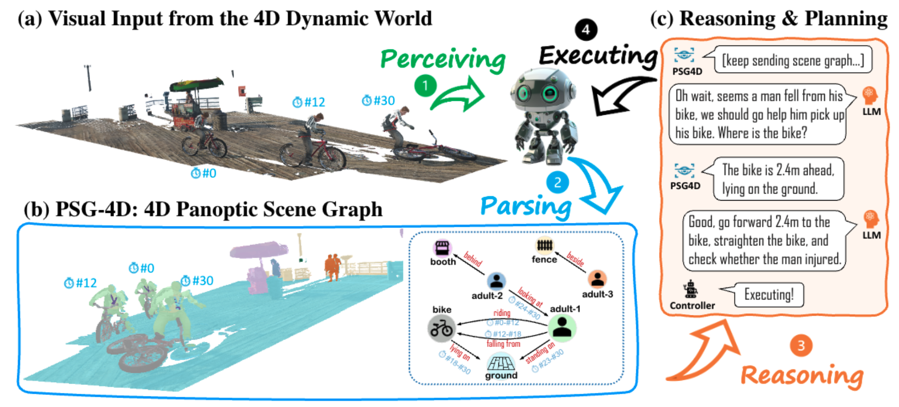

# 4D Panoptic Scene Graph Generation
<p align="center">

https://github.com/Jingkang50/OpenPVSG/assets/17070708/54a0f4c4-daca-4168-8460-95eb4cf8b85a

<video controls>
  <source src="[https://github.com/Jingkang50/OpenPVSG/assets/17070708/54a0f4c4-daca-4168-8460-95eb4cf8b85a](https://github.com/Jingkang50/OpenPVSG/assets/17070708/54a0f4c4-daca-4168-8460-95eb4cf8b85a)" type="video/mp4">
  Your browser does not support the video tag.
</video>

  <p align="center">
  <a href="https://arxiv.org/" target='_blank'>
    
  </a>
  &nbsp;&nbsp;&nbsp;
  <a href="https://jingkang50.github.io/PVSG/" target='_blank'>
    
  </a>
  &nbsp;&nbsp;&nbsp;
  <a href="https://entuedu-my.sharepoint.com/:f:/g/personal/jingkang001_e_ntu_edu_sg/EpHpnXP-ta9Nu1wD6FwkDWAB0LxY8oE9VNqsgv6ln-i8QQ?e=fURefF" target='_blank'>
    
  </a>
  &nbsp;&nbsp;&nbsp;
  <a href="https://entuedu-my.sharepoint.com/:f:/g/personal/jingkang001_e_ntu_edu_sg/EgvpTfCTMudLpxw-h0_BVdcBAHacUaAQD-u9OvkUlpaDBg?e=LXnqaX" target='_blank'>
    
  </a>
  &nbsp;&nbsp;&nbsp;
  <a href="https://github.com/LilyDaytoy/OpenPVSG" target='_blank'>
    
  </p>
  </a>
  <p align="center">
  <font size=5><strong>4D Panoptic Scene Graph Generation</strong></font>
    <br>
        <a href="https://jingkang50.github.io/">Jingkang Yang</a>,
        <a href="https://cen-jun.com/">Jun Cen</a>,
        <a href="https://lilydaytoy.github.io/">Wenxuan Peng</a>,
        <a href="https://github.com/choiszt">Shuai Liu</a>,<br>
        <a href="https://hongfz16.github.io/=">Fangzhou Hong</a>,
        <a href="https://lxtgh.github.io/">Xiangtai Li</a>,
        <a href="https://kaiyangzhou.github.io/">Kaiyang Zhou</a>,
        <a href="https://cqf.io/">Qifeng Chen</a>,
        <a href="https://liuziwei7.github.io/">Ziwei Liu</a>,
    <br>
  S-Lab, NTU & HKUST & BUPT & HKBU
  </p>
</p>

---
## What is PSG4D Task?
<strong>The Panoptic Video Scene Graph Generation (PVSG) Task</strong> aims to interpret a complex scene video with a dynamic scene graph representation, with each node in the scene graph grounded by its pixel-accurate segmentation mask tube in the video.

|  |
|:--:|
| <b>Given a video, PVSG models need to generate a dynamic (temporal) scene graph that is grounded by panoptic mask tubes.</b>|


## The PVSG Dataset
We carefully collect 400 videos, each featuring dynamic scenes and rich in logical reasoning content. On average, these videos are 76.5 seconds long (5 FPS). The collection comprises 289 videos from VidOR, 55 videos from EpicKitchen, and 56 videos from Ego4D.

Please access the dataset via this [link](https://entuedu-my.sharepoint.com/:f:/g/personal/jingkang001_e_ntu_edu_sg/EpHpnXP-ta9Nu1wD6FwkDWAB0LxY8oE9VNqsgv6ln-i8QQ?e=fURefF), and put the downloaded zip files to the place below.
```
├── assets
├── checkpoints
├── configs
├── data
├── data_zip
│   ├── Ego4D
│   │   ├── ego4d_masks.zip
│   │   └── ego4d_videos.zip
│   ├── EpicKitchen
│   │   ├── epic_kitchen_masks.zip
│   │   └── epic_kitchen_videos.zip
│   ├── VidOR
│   │   ├── vidor_masks.zip
│   │   └── vidor_videos.zip
│   └── pvsg.json
├── datasets
├── models
├── scripts
├── tools
├── utils
├── .gitignore
├── environment.yml
└── README.md
```
Please run `unzip_and_extract.py` to unzip the files and extract frames from the videos. If you use `zip`, make sure to use `unzip -j xxx.zip` to remove junk paths. You should have your `data` directory looks like this:
```
data
├── ego4d
│   ├── frames
│   ├── masks
│   └── videos
├── epic_kitchen
│   ├── frames
│   ├── masks
│   └── videos
├── vidor
│   ├── frames
│   ├── masks
│   └── videos
└── pvsg.json
```

We suggest our users to play with `./tools/Visualize_Dataset.ipynb` to quickly get familiar with PSG dataset.

## Get Started
To setup the environment, we use `conda` to manage our dependencies.

Our developers use `CUDA 10.1` to do experiments.

You can specify the appropriate `cudatoolkit` version to install on your machine in the `environment.yml` file, and then run the following to create the `conda` environment:
```bash
conda env create -f environment.yml
conda activate openpvsg
```
You shall manually install the following dependencies.
```bash
# Install mmcv
pip install mmcv-full==1.4.0 -f https://download.openmmlab.com/mmcv/dist/cu101/torch1.7.0/index.html
conda install -c conda-forge pycocotools
pip install mmdet==2.25.0

# already within environment.yml
pip install timm
python -m pip install scipy
pip install git+https://github.com/cocodataset/panopticapi.git

# for unitrack
pip install imageio==2.6.1
pip install lap==0.4.0
pip install cython_bbox==0.1.3

# for vps
pip install seaborn
pip install ftfy
pip install regex

# If you're using wandb for logging
pip install wandb
wandb login
```

Download the [pretrained models](https://entuedu-my.sharepoint.com/:f:/g/personal/jingkang001_e_ntu_edu_sg/ErwH2H27bJpAg9xpaTa49fkB3IJkiLJ6AEFuxUHYKMI1dQ?e=9XINcP) for tracking if you are interested in IPS+Tracking solution.


## Training and Testing
**IPS+Tracking & Relation Modeling**
```bash
# Train IPS
sh scripts/train/train_ips.sh
# Tracking and save query features
sh scripts/utils/prepare_qf_ips.sh
# Prepare for relation modeling
sh scripts/utils/prepare_rel_set.sh
# Train relation models
sh scripts/train/train_relation.sh
# Test
sh scripts/test/test_relation_full.sh
```

**VPS & Relation Modeling**
```bash
# Train VPS
sh scripts/train/train_vps.sh
# Save query features
sh scripts/utils/prepare_qf_vps.sh
# Prepare for relation modeling
sh scripts/utils/prepare_rel_set.sh
# Train relation models
sh scripts/train/train_relation.sh
# Test
sh scripts/test/test_relation_full.sh
```
## Model Zoo
Method    | M2F ckpt | vanilla | filter |  conv |  transformer |
---       | ---  | ---  | ---  | ---  | ---  |
mask2former_ips | [link](https://entuedu-my.sharepoint.com/:f:/g/personal/jingkang001_e_ntu_edu_sg/ErwH2H27bJpAg9xpaTa49fkB3IJkiLJ6AEFuxUHYKMI1dQ?e=9XINcP) | [link](https://entuedu-my.sharepoint.com/:f:/g/personal/jingkang001_e_ntu_edu_sg/ErwH2H27bJpAg9xpaTa49fkB3IJkiLJ6AEFuxUHYKMI1dQ?e=9XINcP) | [link](https://entuedu-my.sharepoint.com/:f:/g/personal/jingkang001_e_ntu_edu_sg/ErwH2H27bJpAg9xpaTa49fkB3IJkiLJ6AEFuxUHYKMI1dQ?e=9XINcP) | [link](https://entuedu-my.sharepoint.com/:f:/g/personal/jingkang001_e_ntu_edu_sg/ErwH2H27bJpAg9xpaTa49fkB3IJkiLJ6AEFuxUHYKMI1dQ?e=9XINcP) | [link](https://entuedu-my.sharepoint.com/:f:/g/personal/jingkang001_e_ntu_edu_sg/ErwH2H27bJpAg9xpaTa49fkB3IJkiLJ6AEFuxUHYKMI1dQ?e=9XINcP) |
mask2former_vps | [link](https://entuedu-my.sharepoint.com/:f:/g/personal/jingkang001_e_ntu_edu_sg/ErwH2H27bJpAg9xpaTa49fkB3IJkiLJ6AEFuxUHYKMI1dQ?e=9XINcP) | [link](https://entuedu-my.sharepoint.com/:f:/g/personal/jingkang001_e_ntu_edu_sg/ErwH2H27bJpAg9xpaTa49fkB3IJkiLJ6AEFuxUHYKMI1dQ?e=9XINcP) | [link](https://entuedu-my.sharepoint.com/:f:/g/personal/jingkang001_e_ntu_edu_sg/ErwH2H27bJpAg9xpaTa49fkB3IJkiLJ6AEFuxUHYKMI1dQ?e=9XINcP) | [link](https://entuedu-my.sharepoint.com/:f:/g/personal/jingkang001_e_ntu_edu_sg/ErwH2H27bJpAg9xpaTa49fkB3IJkiLJ6AEFuxUHYKMI1dQ?e=9XINcP) | [link](https://entuedu-my.sharepoint.com/:f:/g/personal/jingkang001_e_ntu_edu_sg/ErwH2H27bJpAg9xpaTa49fkB3IJkiLJ6AEFuxUHYKMI1dQ?e=9XINcP) |

## Citation
If you find our repository useful for your research, please consider citing our paper:
```bibtex
@inproceedings{yang2023pvsg,
    author = {Yang, Jingkang and Peng, Wenxuan and Li, Xiangtai and Guo, Zujin and Chen, Liangyu and Li, Bo and Ma, Zheng and Zhou, Kaiyang and Zhang, Wayne and Loy, Chen Change and Liu, Ziwei},
    title = {Panoptic Video Scene Graph Generation},
    booktitle = {CVPR},
    year = {2023},
}
```