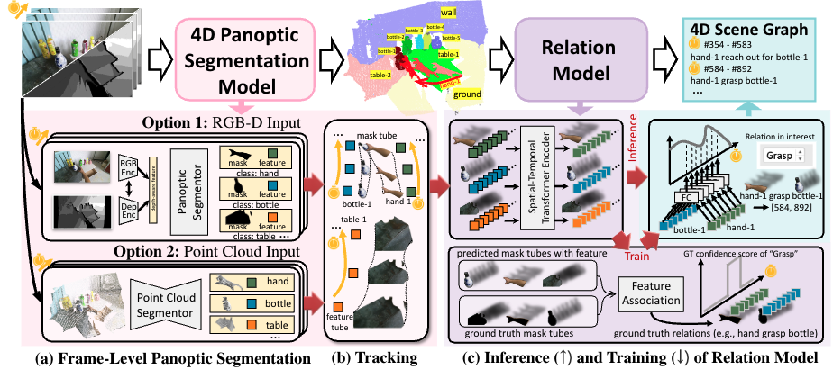

# 4D Panoptic Scene Graph Generation
<p align="center">

|  |
|:--:|

  <p align="center">
  <a href="https://arxiv.org/abs/2405.10305" target='_blank'>
    
  </a>
  &nbsp;&nbsp;&nbsp;
  <a href="https://entuedu-my.sharepoint.com/:f:/g/personal/jingkang001_e_ntu_edu_sg/EhUgIeYBPmVCvqeaJA-hmzkBdVcXt1QKtw3DX9a5zTnLsg?e=rUItPm" target='_blank'>
    
  </a>
  &nbsp;&nbsp;&nbsp;
  <a href="https://entuedu-my.sharepoint.com/:f:/g/personal/jingkang001_e_ntu_edu_sg/EsjNwS7KKDVIuM2NyiKeR-sBowGs-OfmWy2cTaXinpJ7hQ?e=baWkgm" target='_blank'>
    
  </a>
  &nbsp;&nbsp;&nbsp;
  <a href="https://github.com/jingkang50/PSG4D" target='_blank'>
    
  </p>
  </a>
  <p align="center">
  <font size=5><strong>4D Panoptic Scene Graph Generation</strong></font>
    <br>
        <a href="https://jingkang50.github.io/">Jingkang Yang</a>,
        <a href="https://cen-jun.com/">Jun Cen</a>,
        <a href="https://lilydaytoy.github.io/">Wenxuan Peng</a>,
        <a href="https://github.com/choiszt">Shuai Liu</a>,<br>
        <a href="https://hongfz16.github.io/=">Fangzhou Hong</a>,
        <a href="https://lxtgh.github.io/">Xiangtai Li</a>,
        <a href="https://kaiyangzhou.github.io/">Kaiyang Zhou</a>,
        <a href="https://cqf.io/">Qifeng Chen</a>,
        <a href="https://liuziwei7.github.io/">Ziwei Liu</a>,
    <br>
  S-Lab, NTU & HKUST & BUPT & HKBU
  </p>
</p>

---
## What is PSG4D Task?
<strong>The PSG4D (4D Panoptic Scene Graph Generation) Task</strong> is a novel task that aims to bridge the gap between raw visual inputs in a dynamic 4D world and high-level visual understanding. It involves generating a comprehensive 4D scene graph from RGB-D video sequences or point cloud video sequences.

## The PSG4D Dataset

We provide two dataset to facilitate PSG4D research. Each dataset is composed with RGB-D/3D videos. To access them, please checkout [`data/GTA`](data/GTA) and [`data/HOI`](data/GTA). If you find downloading PSG4D-GTA dataset challenging, please email `jingkang001@e.ntu.edu.sg` for some useful tips.


|  ||
|:--:|:--:|
| PSG4D-GTA Dataset Demo | PSG4D-HOI Dataset Demo |


## How to Run
|  |
|:--:|
|<b>Illustration of the PSG4DFormer pipeline.</b> The PSG4DFormer is a two stage pipeline. For Panoptic Segmentation part, please refer to `rgbd_seg` for RGB-D segmentation and `pc_seg` for point cloud segmentation. Then please refer to `*_track`. The relation modeling is identical to our previous work [OpenPVSG](https://github.com/LilyDaytoy/OpenPVSG?tab=readme-ov-file#training-and-testing). Each part can be considered as a standalone code, so please checkout the readme in each directory.|


## Citation
If you find our repository useful for your research, please consider citing our paper:
```bibtex
@inproceedings{yang2023psg4d,
    author = {Yang, Jingkang and Cen, Jun and Peng, Wenxuan and Liu, Shuai amd Hong, Fangzhou and Li, Xiangtai and Zhou, Kaiyang and Chen, Qifeng and Liu, Ziwei}
    title = {4D Panoptic Scene Graph Generation},
    booktitle = {NeurIPS},
    year = {2023},
}
```
